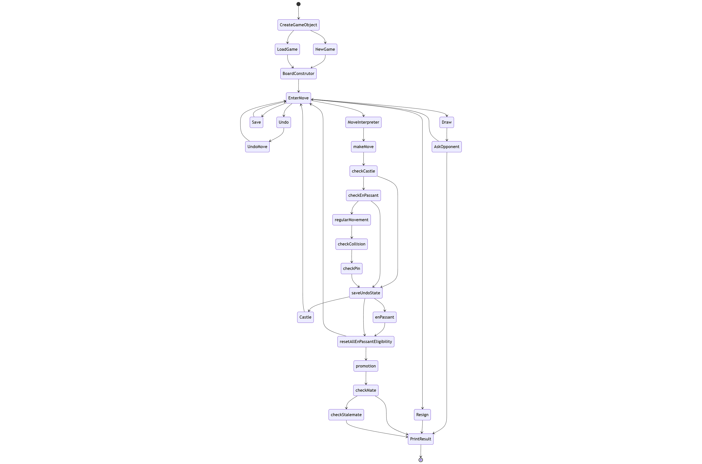

# Krovat-Console-Chess
The third project of team Krovat for OOP class

## (BG)

### 1. Описание
Krovat-Console-Chess е конзолен шах, който поддържа:
- Стандартни правила на шаха
- Проверка за шах, шахмат и пат
- Рокада, ан пасан и промоция на пешка
- Запазване и зареждане на игра
- Връщане един ход назад (Undo)
- Предлагане на реми и предаване

### 2. Инструкции за използване - инсталация и стартиране
Изисквания:
- Java 25
- Конзола/терминал или IDE (IntelliJ IDEA, Eclipse и др.)

Стартиране от конзола в директорията, където се намира проекта:\
javac *.java\
java Main

Стартиране от IDE:\
1. Отворете проекта в IDE
2. Намерете класа Main
3. Стартирайте метода main()

### 3. Алгоритъм
State diagram:

### 4. Обяснение на кода

### 5. Екип. Разпределение на работата
- Иванета - Board instructions, constructors, toString, getKingCoordinates, checkCheck, checkCollision, saveUndoState, undoMove and makeMove methods, Piece, Coordinates, Queen, copy method and copy constructors in all pieces, InvalidMove, README
- Виктор - Knight, King, checkMate, checkStalemate, hasValidMoves, README, presentation
- Самуил - Pawn, promotion, checkEnPassant, enPassant, getPiece, resetAllEnPassantEligibility, checkPin
- Игнат - Rook, Bishop, checkCastle, castle